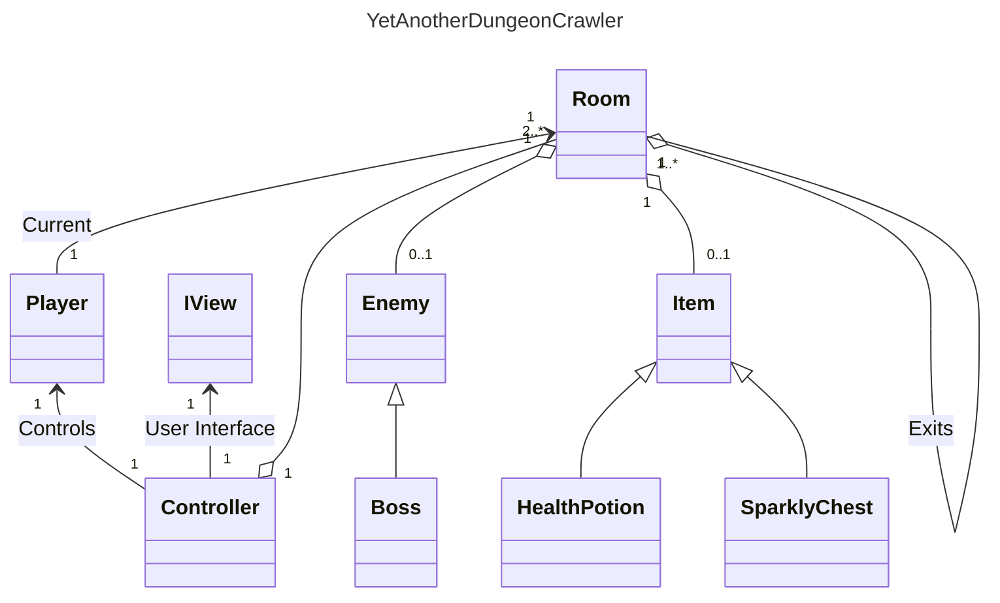
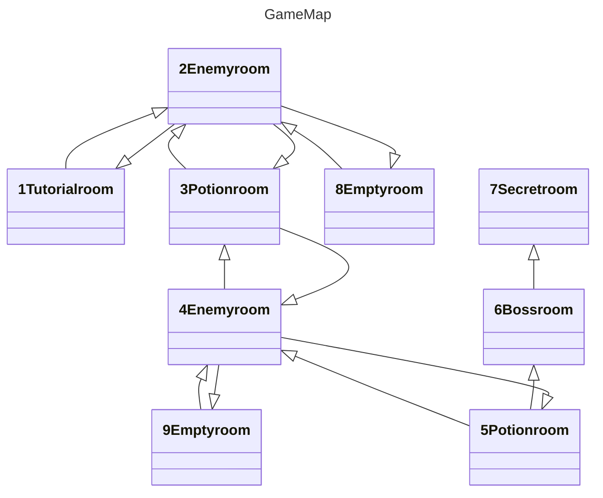

# Yet Another Dungeon Crawler

### Alexandre Almeida (22302190), Daniela Peixoto (22305364), Daniela Sousa (22307091)

## Introdução
Yet Another Dungeon Crawler é um explorador de masmorras, onde o jogador explora um conjunto de masmorras, enfrentando inimigos enquanto procura por tesouros. Em cada uma das salas, o jogador pode encontrar inimigos para enfrentar ou items que o ajudarão. O jogo apenas acaba quando o jogador morre os sai da masmorra, regressando à primeira sala.

## Lista de Tarefas Individuais
* Alexandre Almeida
    * Desenvolver a interface do utilizador.
    * Comentar todo o código desenvolvido (XML).
    * Compor este relatório, com linguagem markup adequada.
    * Desenvolver um diagrama UML, utilizando o Mermaid, que apresenta a arquitetura do projeto.
    * Class IView.
* Daniela Peixoto
    * Class Enemy
    * Class Player
    * Class Controller
    * Class Item
* Daniela Sousa
    * Criação do Repositório 
    * Class Controller
    * Class Program
    * Class Item
    * Class Room

Link do repositório: https://github.com/DanielaPSousa/LP1Projeto2

## Arquitetura da Solução do Projeto
Nesta parte do relatório, iremos decrever lista de ficheiros indicando e descrevendo as funções mais importantes.

## Lista de Ficheiros
* Program.cs - 
Contém a classe **Program**, que implementa a função principal, a partir da qual o programa começa a ser executado.
    * ```public static void Main(string[] args)```
    Função principal que configura o ambiente do jogo, de acordo com o design MVC.

* Controller.cs - 
Contém a classe **Controller**, que implementa o controlador do jogo de acordo com o padrão de design MVC, contendo a função de inicialização e o loop do jogo.
Construtor da classe Controller que chama a função de inicialização.
Função que inicializa o jogo, criando um novo jogador e um conjunto de salas conectadas (mapa) contendo vários inimigos e items. A sala inicial para o jogador também é definida.
Função que inicia o jogo definindo a interface do utilizador, dando as boas-vindas ao jogador e chamando a função de loop do jogo.
Função que solicita que a interface do utilizador mostre a informação da sala atual, onde o jogador se encontra.
Função que mantém a sequência lógica do jogo, permitindo ao jogador deslocar-se entre salas, combater inimigos e apanhar objectos.
Função que simula o movimento do jogador da sala atual para outra sala através de uma saída, se possível.
Função que implementa um ataque do jogador ao inimigo que está localizado na sala atual do jogador.
Função que implementa a ação de apanhar um item, disponível na sala atual do jogador, e que permite também receber os efeitos de dito item.

* Enemy.cs - 
Classe que implementa um NPC inimigo.
Construtor da classe inimiga que define a sua vida inicial e poder de ataque.
Função que simula um ataque a um determinado jogador, diminuindo a quantidade de pontos de vida do jogador de acordo com o poder de ataque do inimigo.

* Item.cs - 
Classe que representa um item existente.
Construtor para a classe **Item** que define o nome do item.
Classe que implementa a poção de vida, um tipo de item que está disponível no jogo.
Construtor da classe **HealthPotion** que define a quantidade de pontos de vida que a poção restaura.
Classe que implementa o sparkly chest (baú cintilante), que é um tipo de item disponível no jogo.
Construtor da classe **SparklyChest** que define a quantidade de moedas contidas no baú.

* IView - 
Classe que implementa a interface do utilizador para o jogo.
Construtor da interface do utilizador que define o texto estático e as cores de fundo.
Função que apresenta uma determinada mensagem ao utilizador no terminal.
Função que apresenta ao utilizador no terminal todas as informações sobre uma determinada sala.
Função que apresenta todas as informações sobre um determinado jogador ao utilizador no terminal.

* Player.cs - 
Classe que implementa o jogador. O jogador tem pontos de vida, poder de ataque e uma quantidade de moedas, para além da sala onde se encontra atualmente.
Construtor para a classe do jogador.
Função que associa uma nova sala ao jogador, simulando o movimento deste para outra sala.
Função que simula um ataque a um inimigo, diminuindo a sua saúde de acordo com o poder de ataque do jogador.
Função que simula um jogador a apanhar um objeto e a receber os seus efeitos.
Função que aumenta a quantidade de moedas que o jogador possui.

* Room.cs - 
Classe que implementa uma sala que pode conter inimigos e itens no seu interior. Uma sala também pode ter várias saídas, que levam a outras salas.
Construtor da classe da sala que armazena a descrição da divisão e cria uma estrutura de memória para as possíveis saídas.
Função que adiciona uma nova saída a uma determinada sala.

## Diagrama UML da Solução do Projeto



## Diagrama UML do Mapa do Jogo


## Referências
* Para ajudar no código, foi utilizado um guia de [C# Keywords](https://learn.microsoft.com/en-us/dotnet/csharp/language-reference/keywords/), da Microsoft.
* Utilizamos o ChatGPT para termos uma direção de como fazer o UI e como meter também a contagem dos moves e os scores que o jogador faz. 